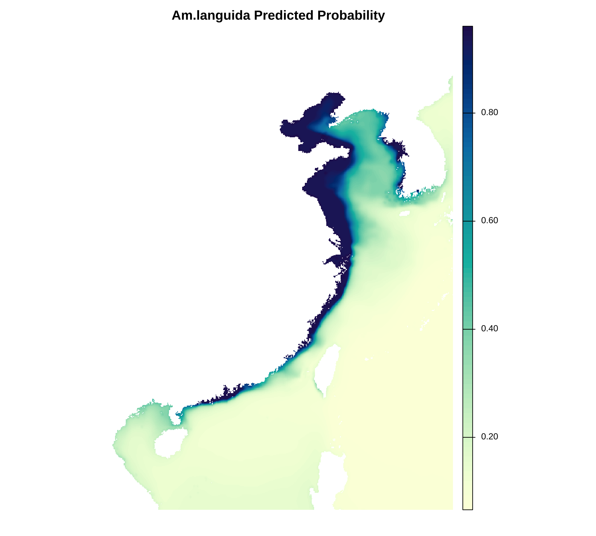
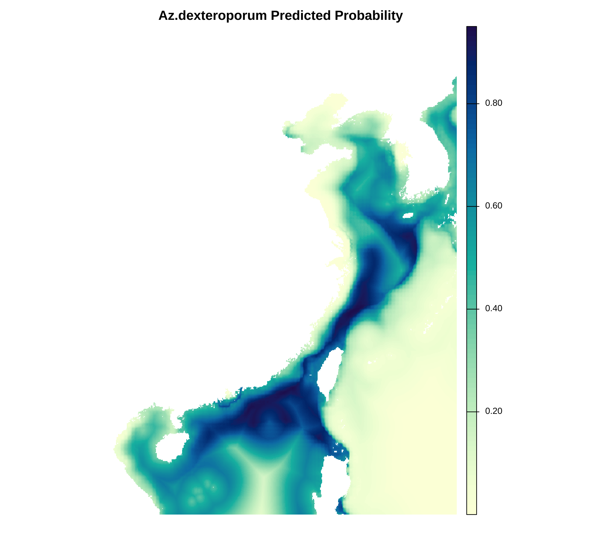

<p align="center">
  <strong>📍 Maxent 预测输出展示图</strong><br/>
  
  
</p>
<p align="center">
  📄 <a href="Am.languida Maxent Modeling Report.pdf">Am.languida Maxent Modeling Report.pdf</a> — 自动生成的模型报告<br/>
  📄 <a href="Az.dexteroporum Maxent Modeling Report.pdf">Az.dexteroporum Maxent Modeling Report.pdf</a> — 自动生成的模型报告<br/>
  📄 <a href="Maxent model for Am.languida.pdf">Maxent model for Am.languida.pdf</a> — 手动 Maxent 构建模型报告<br/>
  📄 <a href="Maxent model for Az.dexteroporum.pdf">Maxent model for Az.dexteroporum.pdf</a> — 手动 Maxent 构建模型报告
</p>

# Twospecies 物种分布建模项目

---

## 项目简介

**Twospecies** 是一个基于 Maxent 的两种物种分布建模完整项目，涵盖了从数据清洗、环境变量处理、建模到结果分析的全流程。  
项目包含原始物种点位数据、环境变量数据、建模脚本与输出结果。为保证 GitHub 仓库的轻量化，**大数据文件请通过下方“数据获取”部分提供的百度网盘地址下载。**

---

## 目录结构

```
.
├── 📂 cleaned_points             # 清洗后的物种分布点（CSV 和 Shapefile）
├── 📂 cor_analysis               # 环境变量相关性分析及筛选结果
├── 📂 env_layers_asc             # 环境变量（ASC 栅格格式）
├── 📂 env_layers_tif             # 环境变量（TIF 栅格格式）
├── 📂 envir                      # 原始环境数据（NetCDF、tif等）
├── 💻 maxent                     # Maxent 执行程序及脚本
├── 📊 model_output               # Maxent 建模输出结果（预测栅格、响应曲线等）
├── 📂 occurrences                # 原始物种分布点（CSV）
├── 📂 output_Amlanguida          # Am.languida 物种 Maxent 输出详细文件
├── 📂 output_Azdexteroporum      # Az.dexteroporum 物种 Maxent 输出详细文件
├── 💻 scripts                    # 项目核心 R 脚本
├── 📄 README.md                  # 项目说明文档（本文件）
├── 📄 .gitignore                 # Git 跟踪忽略文件
├── 📄 project_tree.txt           # 项目目录树文本
└── 💻 upload_model_output.sh     # 自动上传脚本示例
```

---

## 数据获取

> **注意：** 本仓库仅包含必要的代码和示例数据。  
> **完整的大数据文件（物种点位和环境变量）请通过以下百度网盘地址下载：**  
> 通过网盘分享的文件：test.zip
链接: https://pan.baidu.com/s/1EVo0V32Ezx7bDVmnwOQ77w?pwd=de5b 提取码: de5b 
--来自百度网盘超级会员v6的分享

下载后请将数据分别放置于对应目录：

- 物种分布点数据：`occurrences/`
- 原始环境数据（NetCDF、tif）：`envir/`

---

## 快速上手

1. **数据清洗**  
   使用 `scripts/data_cleaning.R` 对 `occurrences/` 中的原始点位数据进行合并、去重和错误剔除。  
   清洗后数据保存在 `cleaned_points/`（CSV 和 Shapefile 格式）。  
   📌 示例路径：`T-cleaned_points/Am.languida_cleaned.csv`

2. **环境变量预处理**  
   使用 `scripts/env_preprocessing.R` 将 `envir/` 中的 NetCDF 和 tif 文件转换为栅格格式，输出至 `env_layers_asc/` 和 `env_layers_tif/`。  
   📌 示例路径：`T-env_layers_asc/po4.asc`, `T-env_layers_tif/po4.tif`

3. **环境变量相关性分析**  
   运行 `scripts/correlation_analysis.R`，对环境变量进行相关性筛选，结果保存在 `cor_analysis/`。  
   📌 示例路径：`T-cor_analysis/selected_vars.txt`

4. **准备 Maxent 输入数据**  
   使用 `scripts/prepare_maxent_input.R`，结合清洗后的点位和筛选后的环境变量，生成 Maxent 所需的样本和背景点文件，存于 `maxent/input/`。  
   📌 示例路径：`maxent/input/species.csv`

5. **运行 Maxent 建模**  
   通过 `scripts/run_maxent.R` 调用 Maxent.jar，自动完成模型训练与预测，结果输出至 `model_output/` 及对应的 `output_Amlanguida/` 和 `output_Azdexteroporum/`。  
   📌 示例路径：`T-output_Amlanguida/Az.dexteroporum_prediction.tif`

---

## 分析流程

### 1. 数据清洗

- **输入数据：** `occurrences/*.csv`  
- **脚本路径：** `scripts/data_cleaning.R`  
- **输出数据：** 清洗后的点位，保存于 `cleaned_points/`（CSV 和 Shapefile）  
📌 示例输入：T-occurrences/Az.dexteroporum.csv  
📌 示例输出：T-cleaned_points/Az.dexteroporum_cleaned.csv

### 2. 环境变量准备与筛选

- **输入数据：** `envir/*.nc`、`envir/*.tif`  
📌 示例输入：T-envir/po4_baseline_2000_2018_depthsurf_6006_d51b_00e9_U1747104907431.nc  
- **脚本路径：** `scripts/env_preprocessing.R`  
- **输出数据：** 环境变量栅格文件，分别存储于 `env_layers_asc/` 和 `env_layers_tif/`  
📌 示例输出：T-env_layers_asc/po4.asc, T-env_layers_tif/po4.tif

- **相关性分析**  
  - **输入数据：** `env_layers_asc/` 中的栅格文件  
  📌 示例输入：T-env_layers_asc/*.asc  
  - **脚本路径：** `scripts/correlation_analysis.R`  
  - **输出数据：** 相关性分析报告及最终变量列表，保存在 `cor_analysis/`  
  📌 示例输出：T-cor_analysis/selected_vars.txt

### 3. 构建 Maxent 输入数据

- **输入数据：**  
  - 清洗后的点位文件 `cleaned_points/*.csv`  
  - 筛选后的环境变量栅格（`env_layers_asc/` 或 `env_layers_tif/`）  
  📌 示例输入：T-cleaned_points/Am.languida_cleaned.csv + T-env_layers_asc/*.asc  
- **脚本路径：** `scripts/prepare_maxent_input.R`  
- **输出数据：** Maxent 输入文件，存放于 `maxent/input/`  
📌 示例输出：maxent/input/species.csv

### 4. Maxent 建模（R 脚本自动化）

- **输入数据：** `maxent/input/` 中的样本和环境变量数据  
- **脚本路径：** `scripts/run_maxent.R`  
- **输出数据：**  
  - 模型结果、响应曲线、预测分布图等  
  - 分别保存于 `model_output/`、`output_Amlanguida/` 和 `output_Azdexteroporum/`（根据物种不同）  
  📌 示例输出：T-output_Amlanguida/Az.dexteroporum_prediction.tif

- **功能说明：** 自动完成模型训练和预测，方便批量处理和参数调整。

### 5. Maxent.jar 图形界面/命令行建模（可选）

- **程序位置：** `maxent/` 文件夹  
- **说明：**  
  - 可使用 Maxent 图形界面手动调整参数和运行模型  
  - 支持命令行批量执行，相关示例和说明位于 `maxent/` 及 `scripts/run_maxent.R`

### 6. 结果分析与可视化

- **脚本路径：** `scripts/model_evaluation.R`  
- **输入数据：** `model_output/` 中的模型预测结果  
- **功能说明：**  
  - 统计模型性能指标（如 AUC、TSS）  
  - 制作预测分布图、响应曲线图和变量贡献图  
  - 输出图表及报告保存在 `model_output/`  
  - 结合 GIS 软件进行空间展示和进一步分析，相关栅格和矢量文件保存在 `model_output/` 和 `output_*` 文件夹中

---

### 7 HTML 报告自动生成（可选）

- **脚本路径：** `scripts/report.R`  
- **RMarkdown 模板：** `scripts/maxent_report.Rmd`
- **输入数据：**  
  - 模型参数表（`*_optimal_params.csv`）  
  - Jackknife 图和变量贡献表  
  - 响应曲线、预测图等输出图片  
- **输出文件：** HTML 格式的建模报告，保存在每个物种的 `T-model_output/` 下

📌 示例输出：`T-model_output/Az.dexteroporum_maxent_report.html`

- **运行方法：**  
  可通过以下命令运行该脚本并生成报告：

  ```r
  source("scripts/report.R")
  ```

  或手动使用 `rmarkdown::render()` 渲染：

  ```r
  rmarkdown::render(
    input = "scripts/maxent_report.Rmd",
    output_file = "Az.dexteroporum_maxent_report.html",
    params = list(
      species = "Az.dexteroporum",
      model_dir = "T-model_output",
      ...
    ),
    knit_root_dir = "T-model_output"
  )
  ```

> 💡 自动报告包括物种信息、最优参数、响应曲线、Jackknife图、预测概率图等完整内容，适用于模型归档和科研展示。

---


## 8 Maxent.jar使用方法示例

---

## Maxent 手动运行指南（macOS / Windows）

除了自动化 R 脚本外，你也可以通过 Maxent 图形界面手动操作模型构建。以下为两种常见操作系统的使用指南：

### 🔧 macOS 上运行 Maxent

1. 打开终端，进入 Maxent 程序目录（本项目为 `maxent/`）：
   ```bash
   cd path/to/project/maxent
   ```

2. 运行 Maxent 图形界面（确保已安装 Java）：
   ```bash
   java -jar maxent.jar
   ```

3. 在弹出的界面中配置以下内容：
   - **Samples file**：物种点 CSV（例如 `T-cleaned_points/Am.languida_cleaned.csv`）
   - **Environmental layers**：选择环境变量文件夹（例如 `T-env_layers_asc/`）
   - **Output directory**：选择结果输出目录（例如 `T-output_Amlanguida/`）
   - 其余参数可默认或根据需求调整

4. 点击 `Run` 开始建模。

---

### 🖥 Windows 上运行 Maxent

1. 双击打开 `maxent/maxent.bat` 或直接在命令行中运行：
   ```cmd
   java -jar maxent.jar
   ```

2. 同样在图形界面中设置输入文件和输出路径。

3. 如需批量建模或自动执行，也可以写 `.bat` 脚本，结合参数化操作运行多个物种模型。

---

> 注意：Projection layers 可选，仅在需要对模型进行转移投影（如预测未来气候或其他区域）时配置。


---

## 贡献指南

感谢您对本项目的关注与支持！  
欢迎提交 issue 和 pull request，帮助我们完善项目。  

- 请确保代码风格统一，注释清晰  
- 提交前请测试相关功能，确保无误  
- 对于数据和脚本的修改，请在 README 或注释中详细说明  

---

## 致谢

感谢AI，感谢 Maxent 软件提供的强大建模支持。  
项目参考了多篇物种分布建模领域的经典文献与开源资源。

---

## License

本项目遵循 [MIT License](https://opensource.org/licenses/MIT) 许可协议，欢迎自由使用和修改，但请保留原作者信息。
